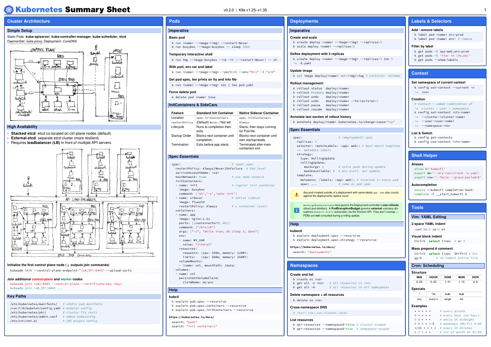

# Kubernetes Summary Sheet

A dense, 8-page reference sheet covering the most important Kubernetes concepts, commands, and manifest patterns. Typeset with LuaLaTeX as a compact, printable A4 landscape PDF.



## Topics covered

| Page | Content |
|------|---------|
| 1 | Cluster Architecture, Pods, Deployments, Namespaces, Labels & Selectors, Context, Shell Helper, Tools |
| 2 | Scheduling (taints, tolerations, affinity, topology), Jobs, Typical Limits |
| 3 | Services & Networking (ClusterIP, NodePort, LoadBalancer, Ingress, DNS, NetworkPolicy), Autoscaling |
| 4 | ConfigMaps & Secrets, Security (SecurityContext, AppArmor, Seccomp), Helm, Kustomize & Extensions |
| 5 | Storage (PV, PVC, StorageClass, CSI), StatefulSets |
| 6 | Certificates (PKI, kubeadm certs, CertificateSigningRequest), Metrics Server & Probes |
| 7 | Pod Disruption Budgets, JSONPath & Output, RBAC |
| 8 | Troubleshooting, Typical Tasks |

## Download

Grab the latest PDF from the [Releases](https://codeberg.org/bnaard/kubernetes-learning/releases) page.

## Building from source

### Prerequisites

The easiest way to get a working build environment is to use the included **Dev Container** (VS Code / GitHub Codespaces / any devcontainer-compatible tool):

```bash
# Open in VS Code with the Dev Containers extension
code .
# → "Reopen in Container"
```

The container includes a full TeX Live installation, `poppler-utils`, and all required fonts.

### Compile

```bash
latexmk --shell-escape -synctex=1 -interaction=nonstopmode -file-line-error \
  -pdflatex=lualatex -pdf \
  -aux-directory=./out -output-directory=./out \
  src/main.tex
```

The PDF is written to `out/main.pdf`.

### Verify output

Render the PDF pages as PNG screenshots with `poppler-utils`:

```bash
pdftoppm -r 150 -png out/main.pdf /tmp/preview
# Produces /tmp/preview-1.png, /tmp/preview-2.png, ...
```

## Releasing

The `scripts/release.sh` script builds the PDF, tags the repo, and publishes a Codeberg release with the PDF attached.

```bash
# Store your Codeberg token in a .env file (gitignored)
echo 'CODEBERG_TOKEN=your_token_here' > .env

# Create a release
./scripts/release.sh v0.3.0
```

Run `./scripts/release.sh --help` for all options.

> **Note:** Releases must be enabled in your Codeberg repository settings for the script to work.

## Project structure

```
src/main.tex            Main document (page layout, styles, macros)
src/*.tex               Topic sections (one file per topic)
src/figures/            Diagrams and illustrations
src/icons/              Icon assets
scripts/release.sh      Build + publish release to Codeberg
.devcontainer/          Dev Container definition (Dockerfile + docker-compose)
.vscode/settings.json   LaTeX Workshop build configuration
out/                    Build output (gitignored)
```

## License

This project is provided as-is for personal and educational use.
